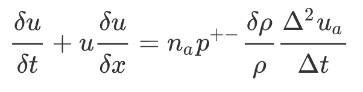

### Navier Stokes Momentum Conservation Model

We take a segment of air of length `l`. Using the theory of Air Dynamics and Law of Diffusion, we find the discretised momentum conservation model evaluated from a velocity time series. 

The process of working with the example is to execute the model within specified time by not compromising the accuracy of the model. This mdoel is developed using a benchmark model developed in Python.

The respository link for the benchmark model:

[https://github.com/aswinvk28/cpp-performance-math-problems-benchmark](https://github.com/aswinvk28/cpp-performance-math-problems-benchmark)

### Allen's Interval Algebra Sum of Limitting Ratios Model

The Allen's Interval Algebra technique uses input probability distributions as a function of position and then finds the sum of limitting ratios of a statistical quantity.

The process of development is to calculate the limitting ratio at each position, for which formula will be given, using a benchmark model developed in python.

## Performance Optimization Explanation

[https://github.com/nscalo/cpp-performance-samples](https://github.com/nscalo/cpp-performance-samples)

You can use:

    - Vectorization, or
    
    - Parallelization using Multithreading or multiprocessing, or
    
    - MPI

to minimise the time shown in the repository, without affecting the accuracy of the model
